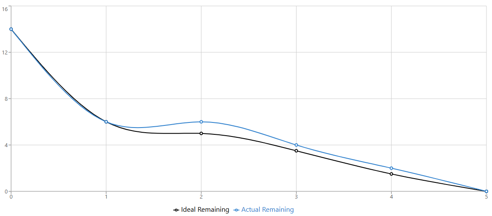

# Sprint 1 Burn-Down Chart  
**Adewole (Person C)**

**Due:** Monday, December 8th at 11:59 PM  
**Total Tasks:** 6  

---

## Burn-Down Data

| Day | Date       | Work Hours              | Ideal Remaining | Actual Remaining |
|----:|------------|-------------------------|-----------------|------------------|
| 1   | Thu Dec 4  | 3:00 PM – 9:15 PM (6.25h) | 6               | 6                |
| 2   | Fri Dec 5  | 3:00 PM – 9:15 PM (6.25h) | 5               | 6                |
| 3   | Sat Dec 6  | 3:00 PM – 9:15 PM (6.25h) | 3.5             | 4                |
| 4   | Sun Dec 7  | 3:00 PM – 9:15 PM (6.25h) | 1.5             | 2                |
| 5   | Mon Dec 8  | —                       | 0               | —                |

---

## Person C Tasks

| Task ID | Task Description                                  | Completion Date |
|--------:|--------------------------------------------------|-----------------|
| T-0.3   | Create base CSS stylesheet                       | 12/06/2025      |
| T-0.4   | Create `error.jsp`                               | 12/07/2025      |
| T-1.6   | Create `signup.jsp`                              | 12/06/2025      |
| T-2.3   | Create `login.jsp`                               | 12/06/2025      |
| T-5.2   | Create `dashboard.jsp` (placeholder stats)       | 12/07/2025      |
| T-5.3   | Create navigation bar component                  | 12/06/2025      |

---
