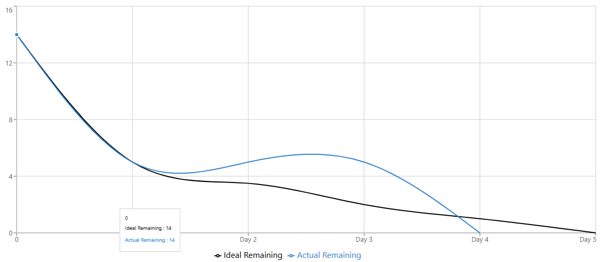

# Sprint 2 Burn-Down Chart  
**Team Member:** Adewole (Person C)  
**Due Date:** Saturday, December 13th at 11:59 PM  
**Total Tasks:** 5  

---

## Burn-Down Data

| Day   | Date        | Work Hours            | Ideal Remaining Tasks | Actual Remaining Tasks |
|------:|------------|-----------------------|-----------------------:|-----------------------:|
| Day 1 | Tue Dec 9  | 3:00 PM – 9:15 PM (6.25h) | 5.0 | 5 |
| Day 2 | Wed Dec 10 | 3:00 PM – 9:15 PM (6.25h) | 3.5 | 5 |
| Day 3 | Thu Dec 11 | 3:00 PM – 9:15 PM (6.25h) | 2.0 | 5 |
| Day 4 | Fri Dec 12 | 3:00 PM – 9:15 PM (6.25h) | 1.0 | 0 |
| Day 5 | Sat Dec 13 | —                     | 0.0 | — |

---

## Person C Tasks

| Task ID | Task Description                                   | Completion Date |
|--------:|---------------------------------------------------|-----------------|
| T-3.3  | Create `calculator.jsp` (input form)              | 12/11/2025 |
| T-3.4  | Create `result.jsp` (show nudge)                  | 12/11/2025 |
| T-4.4  | Create `decision.jsp` (confirmation page)         | 12/11/2025 |
| T-10.3 | Display streak on dashboard                       | 12/11/2025 |
| T-5.6  | Update `dashboard.jsp` with real statistics       | 12/11/2025 |

---

## Notes

- All assigned tasks were completed ahead of the sprint deadline.
- Actual remaining tasks dropped to zero by Day 4, indicating early sprint completion.
- Work hours were consistent across sprint days.

