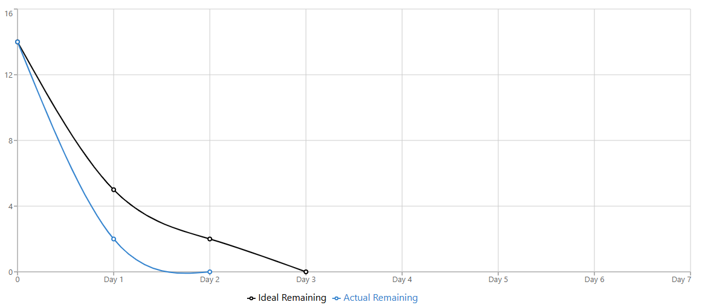

| Sprint 2 Burn-Down Chart - Jeffy (Person B)                                  |                           |            |                |       |
|------------------------------------------------------------------------------|---------------------------|------------|----------------|-------|
| Due: Saturday, December 13th at 11:59 PM                                     |                           |            |                |       |
| Total Tasks: 5  (Sprint 1 Tasks completed early)                             |                           |            |                |       |
|                                                                              |                           |            |                |       |
| **Burn-Down Data**                                                           |                           |            |                |       |
| Day                                                                          | Date                      | Work Hours | Ideal Remaining | Actual |
| Day 1                                                                        | Sun Dec 7                 |            | 5              | 2     |
| Day 2                                                                        | Mon Dec 8                 |            | 2              | 0     |
| Day 3                                                                        | Tue Dec 9                 |            | 0              | 0     |
| Day 4                                                                        | Wed Dec 10                |            | 0              | 0     |
| Day 5                                                                        | Thu Dec 11                |            | 0              | 0     |
| Day 6                                                                        | Fri Dec 12                |            | 0              | 0     |
| Day 7                                                                        | Sat Dec 13                |            | 0              | 0     |
|                                                                              |                 |            |                |       |
| **Person B Tasks:**                                                          | **Task Completion Date:** |            |                |       |
| T-4.1: Create NudgeLog.java model                                            | 12/07/2025                |            |                |       |
| T-4.2: Create NudgeLogDAO.java                                               | 12/07/2025                |            |                |       |
| T-5.4: Add skip rate calculation to NudgeLogDAO                              | 12/07/2025                |            |                |       |
| T-10.1: Add recordSkip() to UserDAO (Same as T-4.5)                          | 12/08/2025                |            |                |       |
| T-10.2: Add recordBuy() to UserDAO (Same as T-4.5)                           | 12/08/2025                |            |                |       |
|                                                                              |                 |            |                |       |
| Note: Jeffy will begin constructing Sprint 3 models and DAOs starting Dec 10 |                 |            |                |       |

