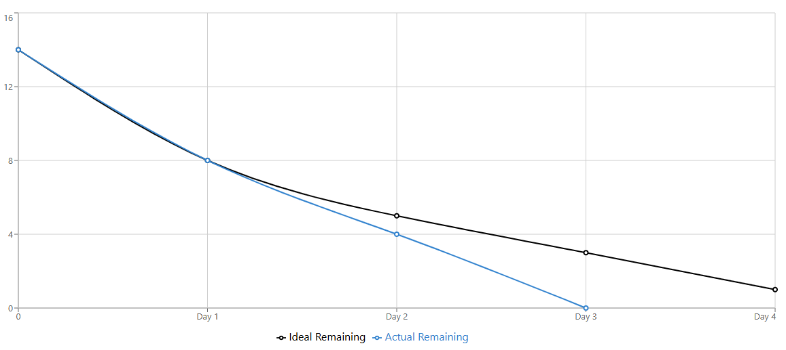

## Burn-Down Data

| Day | Date | Work Hours | Ideal Remaining Tasks | Actual
|----|------|------------|-----------------------|----|
| Day 1 | Mon Dec 15 | 3:00 PM – 9:15 PM (6.25h) | 8 | 8 |
| Day 2 | Tue Dec 16 | 3:00 PM – 9:15 PM (6.25h) | 5 | 4 |
| Day 3 | Wed Dec 17 | 3:00 PM – 9:15 PM (6.25h) | 3 | 0 |
| Day 4 | Thu Dec 18 | 3:00 PM – 9:15 PM (6.25h) | 1 |   |

---

## Tasks Completed (Person C)

| Task ID | Description | Completion Date | Notes |
|-------|------------|----------------|------|
| T-6.4 | Create `setGoal.jsp` | 12/15/2025 | Updated to GitHub |
| T-6.5 | Create `goal.jsp` (view progress) | 12/15/2025 | Updated to GitHub |
| T-7.4 | Create `addTransaction.jsp` | 12/15/2025 | Updated to GitHub |
| T-8.3 | Create `transactions.jsp` | 12/15/2025 | Updated to GitHub |
| T-9.3 | Update `result.jsp` for different levels | 12/16/2025 | Updated to GitHub |
| T-11.3 | Create `profile.jsp` | 12/16/2025 | Updated to GitHub |
| T-11.2 | Conduct user testing (3–5 people) | 12/17/2025 | Updated to Github |
| T-11.4 | Final UI polish | 12/17/2025 | Updated to Github |

---

## Repository
All completed work was committed and pushed to GitHub during the sprint to ensure version control and team visibility.

---

