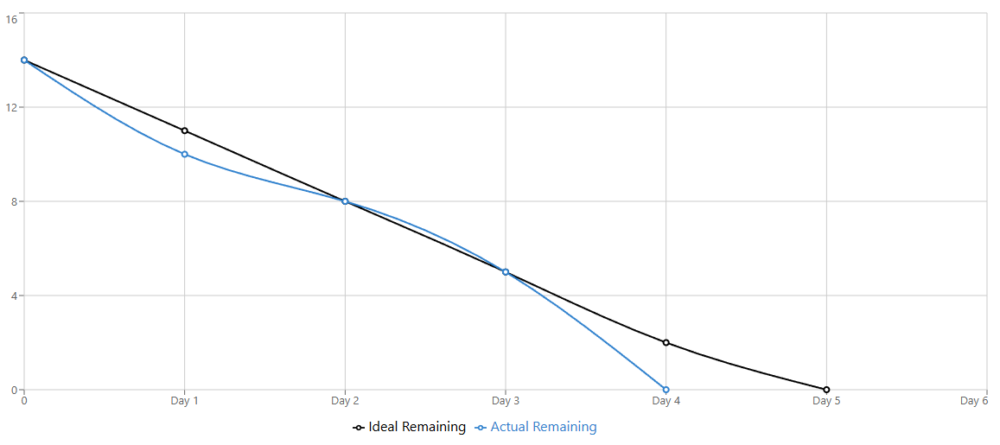

| Sprint 3 Burn-Down Chart - Allan(Person A)        |                    |             |                 |                 |
| ------------------------------------------------- | ------------------ | ----------- | --------------- | --------------- |
| Due: Thursday, December 18th at 11:59 PM             |                    |             |                 |                 |
| Total Tasks: 5                                    |                    |             |                 |                 |
|                                                   |                    |             |                 |                 |
| **Burn-Down Data**                                |                    |             |                 |                 |
| Day                                               | Date               | Work Hours  | Ideal Remaining | Actual          |
| Day 1                                             | Sat Dec 13         |             | 11              | 10              |
| Day 2                                             | Sun Dec 14         | 3PM-11PM    | 8               | 8               |
| Day 3                                             | Mon Dec 15         |             | 5               | 5               |
| Day 4                                             | Tue Dec 16         |             | 2               | 0               |
| Day 5                                             | Wed Dec 17         |             | 0               | 0               |
| Day 6                                             | Thu Dec 18         | 3PM-10:30PM | 0               | 0               |
|                                                   |                    |             |                 |                 |
| **Person A Tasks:**                               |                    |             | **Task Completion Date:** |                 |
| T-6.3: Create GoalServlet.java - Person A                 |                 |                 | 12/13/2025      |                 |
| T-7.3: Create TransactionServlet.java - Person A          |                 |                 | 12/13/2025      |                 |
| T-8.2: Add history view to TransactionServlet - Person A  |                 |                 | 12/15/2025      |                 |
| T-9.1: Implement 3-tier nudge messages - Person A         |                 |                 | 12/15/2025      |                 |
| T-11.2: Add profile action to AuthServlet - Person A      |                 |                 | 12/16/2025      |                 |

